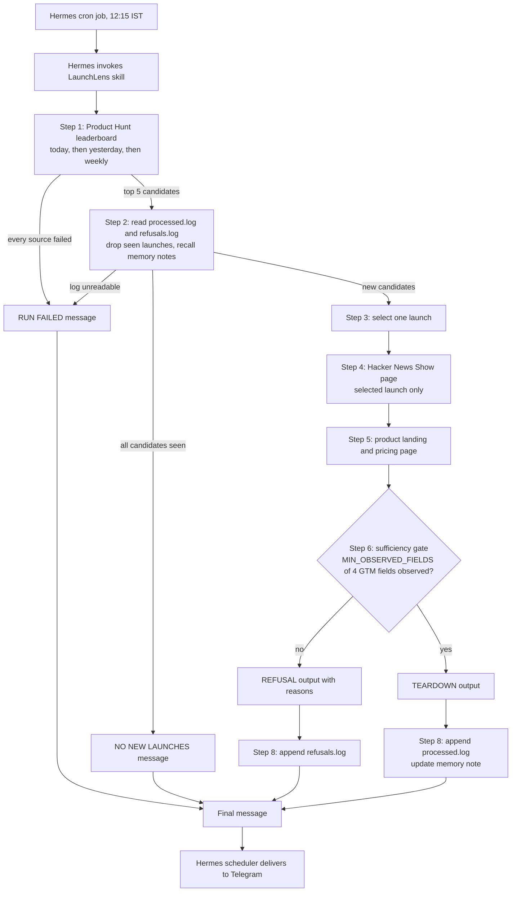

# Runtime path

One run, four possible outcomes. The sufficiency gate is the only thing that
decides between a teardown and a refusal.

Notes:

- The gate threshold is `MIN_OBSERVED_FIELDS` in the Config block of `SKILL.md`.
  It is set to 3 of 4 fields.
- Logging happens before the final message because the skill cannot observe delivery.
  A log line means the output was produced, not that it arrived.
- The cron node reflects the author's own machine. The job definition is in
  `hermes-cron-job.example.json`.
